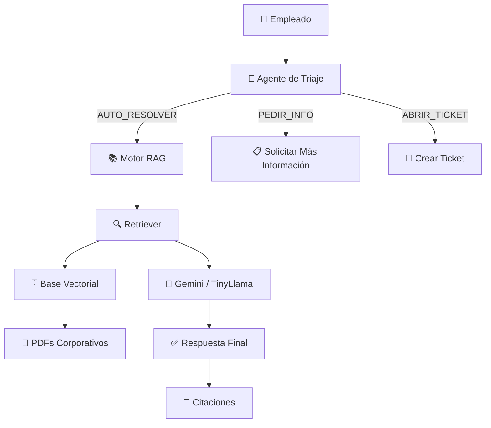
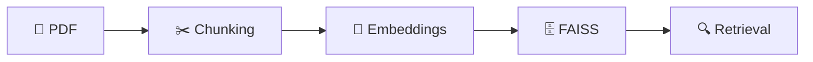
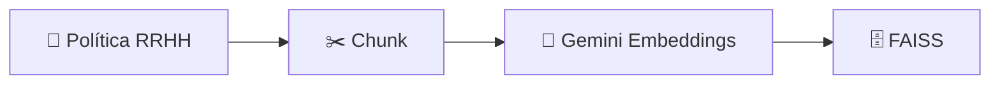
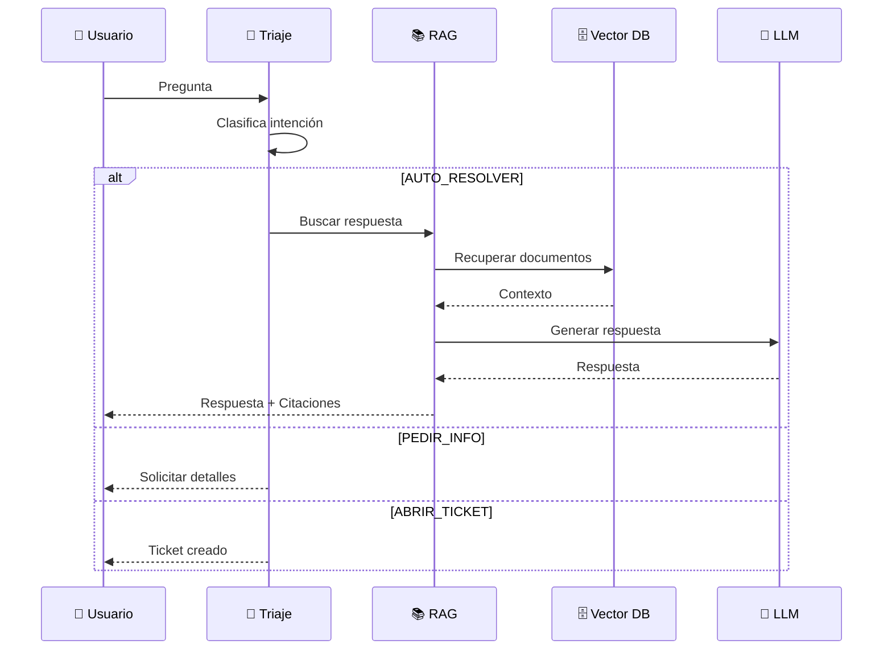
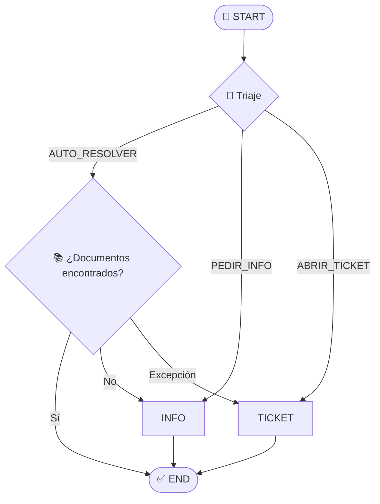
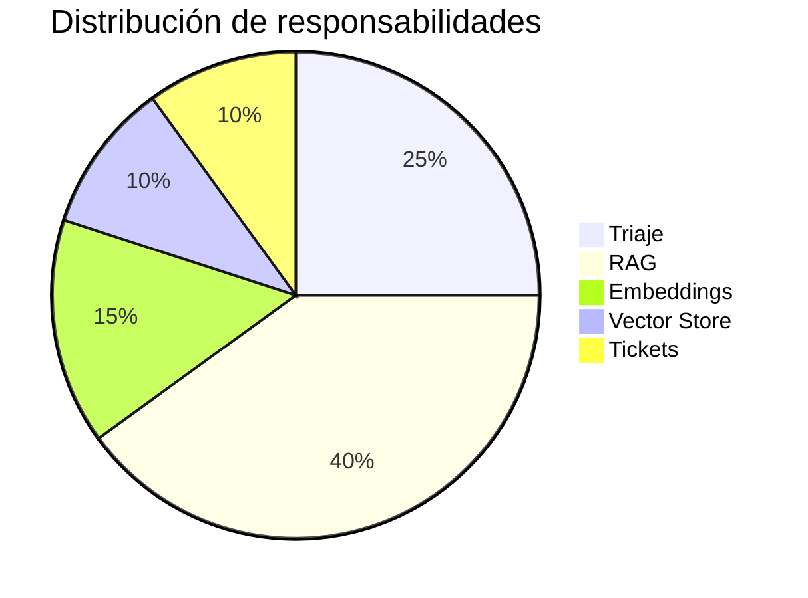

# 🚀🤖 AI Service Desk Multi-Agent RAG System

> *"No todos los tickets merecen un ticket."*

Sistema inteligente de atención interna basado en **LangGraph**, **RAG**, **FAISS**, **Gemini** y **TinyLlama**, capaz de analizar solicitudes de empleados, clasificar intenciones, consultar documentación corporativa y decidir automáticamente la mejor acción.

---

# 🎯 Objetivo

Automatizar el primer nivel de atención de RRHH mediante agentes especializados capaces de:

* ✅ Resolver preguntas frecuentes
* ✅ Buscar información en políticas internas
* ✅ Solicitar información adicional
* ✅ Abrir tickets automáticamente
* ✅ Explicar las respuestas con evidencia documental

---

# 🏗️ Arquitectura General



---

# 🧩 Componentes Principales

## 🧠 Agente de Triaje

Primer filtro del sistema.

### Analiza

* 🎯 Intención
* 🚨 Urgencia
* 📖 Contexto

### Decide

| Acción        | Descripción                         |
| ------------- | ----------------------------------- |
| AUTO_RESOLVER | Puede responderse usando documentos |
| PEDIR_INFO    | Información insuficiente            |
| ABRIR_TICKET  | Excepción o autorización            |

---

## 📚 Motor RAG

Responsable de responder utilizando únicamente información interna.

```text
Pregunta
   ↓
Retriever
   ↓
Documentos relevantes
   ↓
LLM
   ↓
Respuesta fundamentada
```

---

## 📄 Ingesta Documental

Los PDFs corporativos son procesados mediante:



---

# 🔬 Pipeline de Embeddings



---

# 🤖 Agentes del Sistema

## 🧠 Triaje Agent

Clasifica solicitudes.

### Ejemplo

```json
{
  "decision": "AUTO_RESOLVER",
  "urgencia": "BAJA"
}
```

---

## 📚 RAG Agent

Busca información relevante.

### Ejemplo

```text
¿Puedo solicitar reembolso de internet?

↓

Busca políticas

↓

Genera respuesta

↓

Entrega citaciones
```

---

## 🎫 Ticket Agent

Gestiona excepciones.

### Ejemplo

```text
Necesito una excepción para trabajar remoto 5 días.

↓

Ticket automático
```

---

# 🌊 Flujo Completo



---

# 🕸️ Grafo de LangGraph



---

# 📊 Distribución de Responsabilidades



---

# 🛠️ Stack Tecnológico

| Categoría       | Tecnología                     |
| --------------- | ------------------------------ |
| ⚡ Orquestación  | LangGraph                      |
| 🔗 Framework IA | LangChain                      |
| 🧬 Embeddings   | Gemini Embeddings              |
| ☁️ LLM Cloud    | Gemini 2.5 Flash               |
| 💻 LLM Local    | TinyLlama                      |
| 🗄️ Vector DB   | FAISS                          |
| 📄 Parsing PDFs | PyMuPDF                        |
| ✂️ Chunking     | RecursiveCharacterTextSplitter |
| 📓 Notebook     | Google Colab                   |

---

# 🎭 Casos de Uso

## Caso 1: Consulta de Política

### Pregunta

```text
¿Puedo reembolsar mi internet?
```

### Flujo

```text
Usuario
 ↓
Triaje
 ↓
AUTO_RESOLVER
 ↓
RAG
 ↓
Política Home Office
 ↓
Respuesta
```

---

## Caso 2: Solicitud de Excepción

### Pregunta

```text
Necesito una excepción para teletrabajar 5 días.
```

### Flujo

```text
Usuario
 ↓
Triaje
 ↓
ABRIR_TICKET
 ↓
Ticket RRHH
```

---

# 🌟 Características Destacadas

* 🧠 Multi-Agent Architecture
* 📚 Retrieval Augmented Generation (RAG)
* 🎫 Smart Ticket Routing
* 🗄️ Semantic Vector Search
* 📄 PDF Knowledge Base
* 🤖 Cloud + Local LLMs
* 🔍 Explainable Responses
* 📌 Source Citations
* ⚡ LangGraph Workflows
* 🚀 Google Colab Ready

---

# 💙 Filosofía

> Un buen chatbot responde preguntas.
>
> Un gran sistema sabe cuándo responder, cuándo preguntar y cuándo escalar.

---

### 🚀 Construido con LangGraph + LangChain + Gemini + TinyLlama + FAISS

